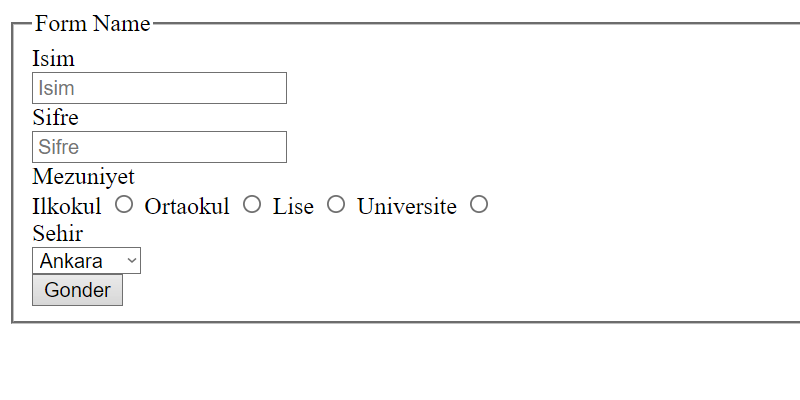
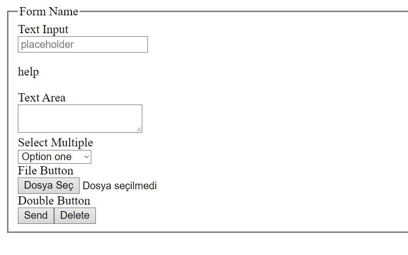
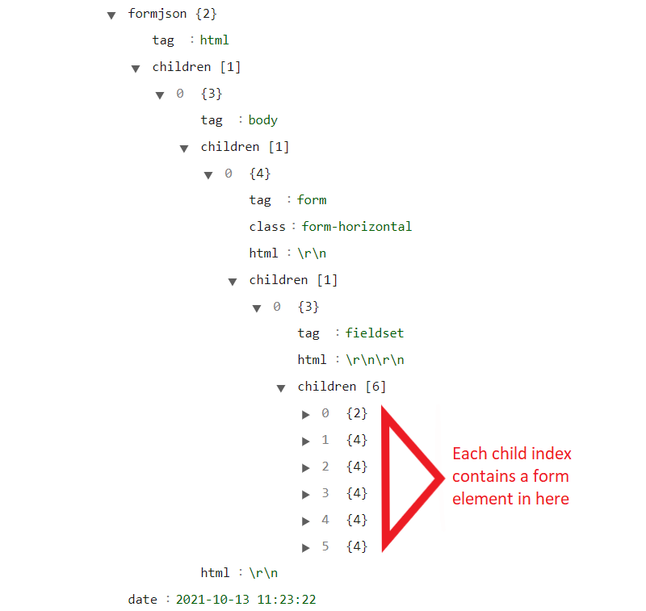

# Dynamic_Form_Generator
## :scroll: About Project
This project is a react.js application that create form dynamically according to different APIs . To try it change "formId" from Service.tsx file.Check console to see results after clicked submit button.

## :computer: Used Technologies

|Languages & Abilities  | 
| ------------- |
| :heavy_check_mark: React.js  | 
| :heavy_check_mark: TypeScript  |
| :heavy_check_mark: JavaScript  |
| :heavy_check_mark: Axios |

## :camera: Screenshots
### Form Example -1

### Form Example -2

### JSON Data Example

